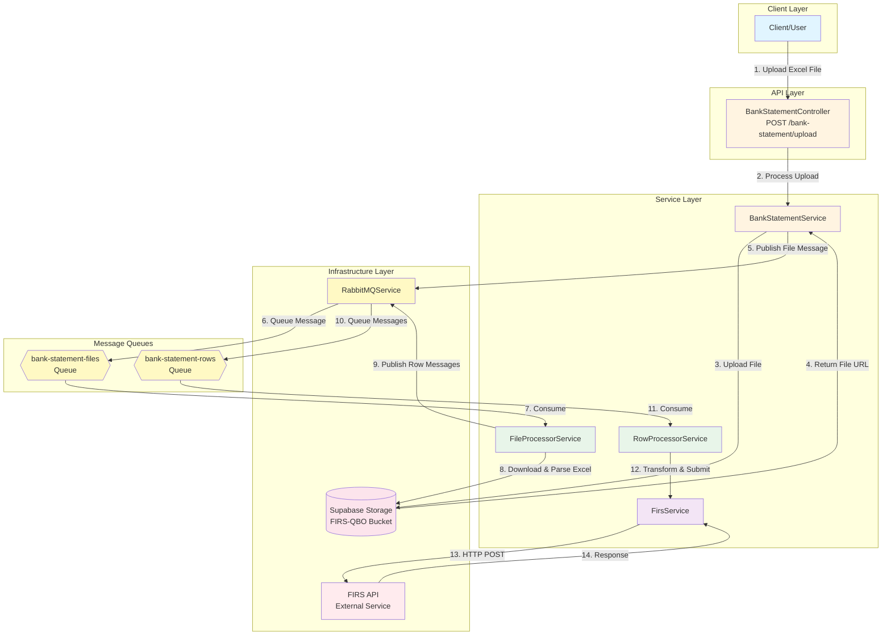
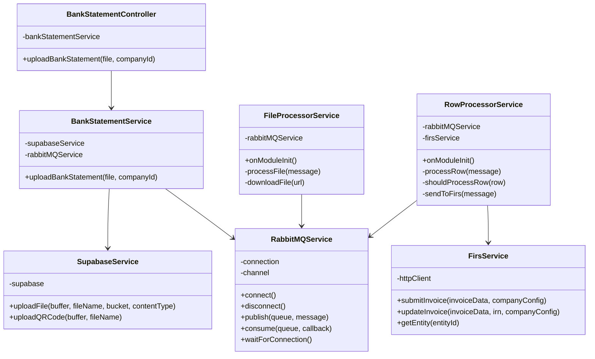
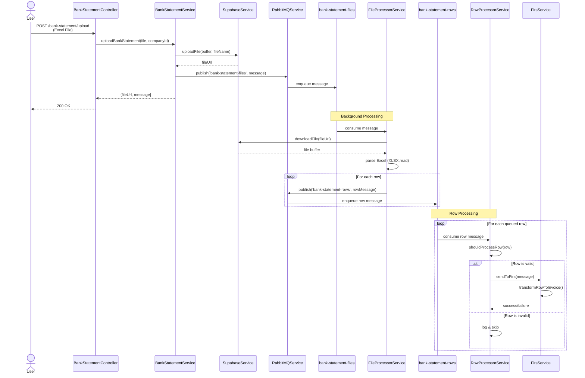
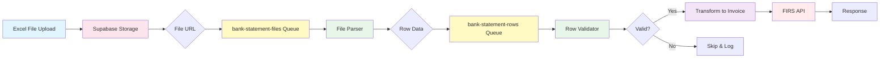
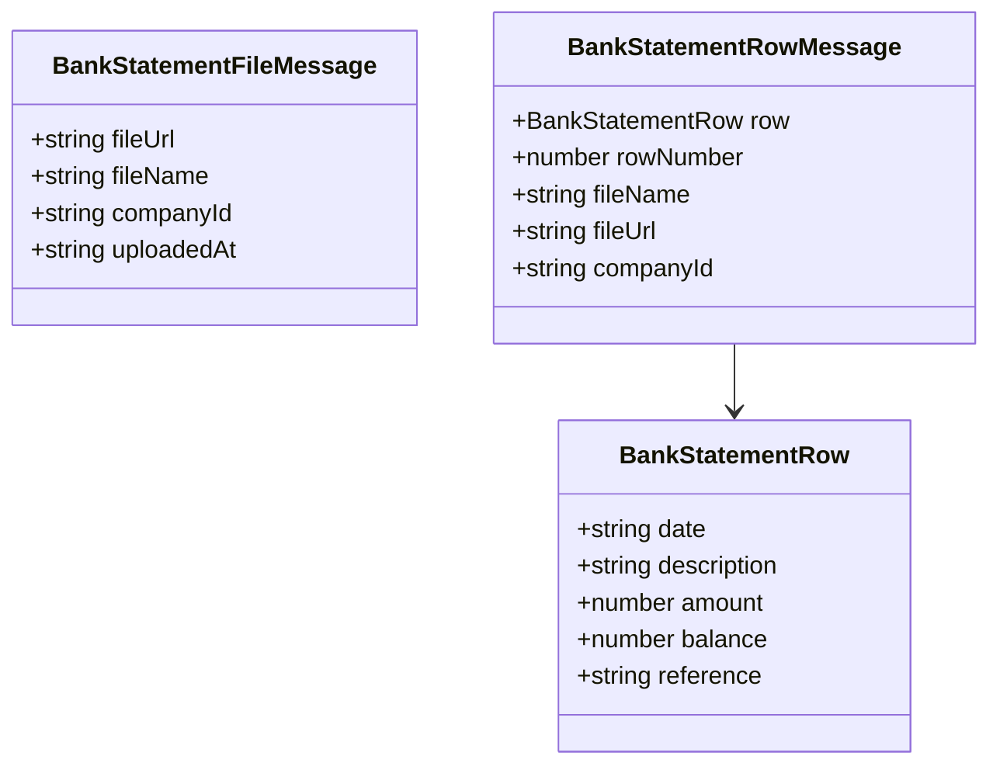
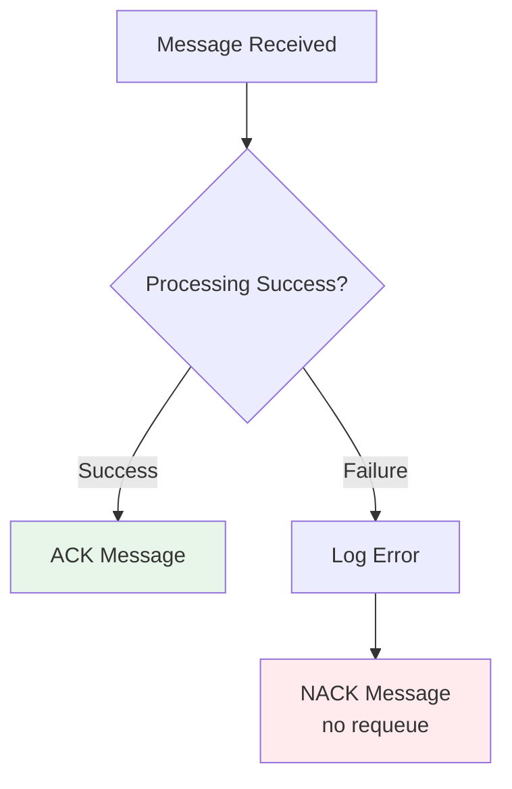

# Bank Statement to FIRS Architecture

## System Overview

This document describes the architecture for processing bank statement Excel files and submitting transaction data to the FIRS service through RabbitMQ message queues.

## Architecture Diagram



## Component Diagram



## Sequence Diagram



## Data Flow



## Message Types



## Key Components

### 1. **BankStatementController**
- **Endpoint**: `POST /bank-statement/upload`
- **Responsibilities**:
  - Accept file uploads
  - Validate file type (Excel: .xls, .xlsx)
  - Delegate to service layer

### 2. **BankStatementService**
- **Responsibilities**:
  - Upload files to Supabase storage
  - Publish file metadata to RabbitMQ
  - Return upload confirmation

### 3. **FileProcessorService**
- **Queue**: Consumes from `bank-statement-files`
- **Responsibilities**:
  - Download Excel files from Supabase
  - Parse Excel using XLSX library
  - Split into individual rows
  - Publish rows to row processing queue

### 4. **RowProcessorService**
- **Queue**: Consumes from `bank-statement-rows`
- **Responsibilities**:
  - Validate row data
  - Transform to invoice format
  - Submit to FIRS service
  - Handle errors and retries

### 5. **RabbitMQService**
- **Responsibilities**:
  - Manage RabbitMQ connection
  - Publish messages to queues
  - Setup consumers with callbacks
  - Handle connection retries

### 6. **FirsService**
- **Responsibilities**:
  - Transform data to FIRS invoice format
  - Submit invoices to FIRS API
  - Handle FIRS API responses

## Queue Configuration

| Queue Name | Consumer | Message Type | Durability |
|------------|----------|--------------|------------|
| `bank-statement-files` | FileProcessorService | BankStatementFileMessage | Durable |
| `bank-statement-rows` | RowProcessorService | BankStatementRowMessage | Durable |

## Error Handling



- **Success**: Message is acknowledged (ACK)
- **Failure**: Message is not acknowledged (NACK) without requeue to prevent infinite loops
- All errors are logged for monitoring

## Environment Variables

```env
RABBITMQ_URL=amqp://localhost:5672
SUPABASE_URL=https://your-project.supabase.co
SUPABASE_ANON_KEY=your-anon-key
FIRS_API_BASE_URL=https://api.firs.gov.ng
```

## Scalability Considerations

1. **Horizontal Scaling**: Multiple instances can consume from the same queues
2. **Queue Durability**: Messages persist if RabbitMQ crashes
3. **Prefetch**: Set to 1 for fair distribution across consumers
4. **Asynchronous**: File upload returns immediately, processing happens in background

## Future Enhancements

- Dead Letter Queue (DLQ) for failed messages
- Message TTL for automatic cleanup
- Priority queues for urgent processing
- Metrics and monitoring integration
- Retry logic with exponential backoff